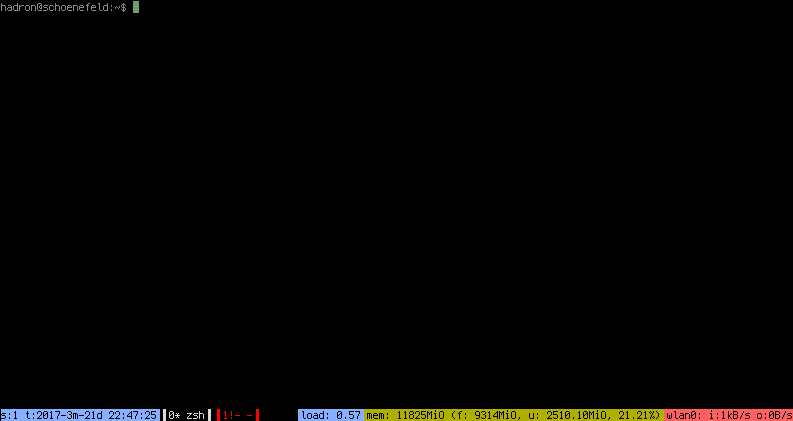

# Dotfiles on Ellenor' freebsd systems

Currently, only a .tmux.conf showing free, used, total memory in mega
binary octets (equal to mega binary bytes on systems with 8-bit bytes)
is available. It doesn't work on anything except FreeBSD as far as I
know.

I've added a network usage script, intended to be stored as ~/totalbytes.tcl. Modify .tmux.conf to suit (vtnet0 default interface).

Requires tclsh8.6 in $PATH - not sure if 8.6 actually required. Modify script shebang line.

Requires terminal of at least 132 columns.

Screenshot of tmux theme:

